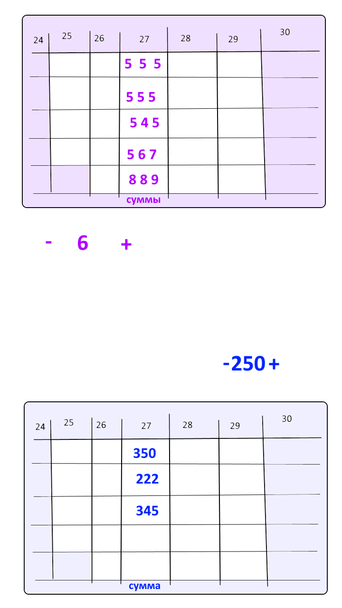

# Dolgator

Минималистичный счётчик повторений в упражнениях и граммов пищи. Личное приложение без сервера — все данные хранятся на телефоне.

**Версия:** 0.1.13 · **Разработчик:** [Trifonix](https://t.me/trifonixwebsites)



## Стек

- **React Native** + **Expo 52**
- **AsyncStorage** — локальное сохранение
- **EAS Build** — сборка APK
- TypeScript

## Быстрый старт

### 1. Node.js

LTS с [nodejs.org](https://nodejs.org/) (версия 20+).

### 2. Зависимости

```bash
git clone https://github.com/<ваш-аккаунт>/dolgator.git
cd dolgator
npm install
```

### 3. Web-превью

```bash
npm run web
```

### 4. Android (Expo Go)

```bash
npm start
```

Установите **Expo Go**, отсканируйте QR-код.

### 5. Сборка APK

Проект уже привязан к EAS (`projectId` в `app.json`). Повторный `eas init` не нужен.

```bash
npx eas login
npm run build:apk
```

> Если загрузка падает с **403 Forbidden**, включите VPN (блокировка Google Cloud) и повторите сборку.

APK скачивается по ссылке из терминала или на [expo.dev/accounts/trifonix/projects/dolgator](https://expo.dev/accounts/trifonix/projects/dolgator).

Перед каждым релизом обновите:
- `src/version.ts`, `src/changelog.ts`, `CHANGELOG.md`
- `app.json` → `version` и `android.versionCode` (+1)

Локальная сборка (нужны JDK 17 + Android Studio):

```bash
npm run build:apk:local
```

## Как пользоваться

### Колбы (центр)

- **Слева (колба на 3 канала)** — ноги / грудь / спина в одном сосуде фиксированной высоты. Засечки снаружи — эталон 80% (прошлый средний подход × 5, иначе шаг счётчика × 5).
- **Справа (еда)** — верх = среднесуточная прошлой недели, иначе 5 × шаг граммов. Засечки снаружи — на 1,5% ниже потолка.

### Упражнения (верх — фиолетовый)

1. **− / +** — выставить повторения
2. **Тап по числу** → «Вы сделали N повторений?» → **Да**
3. Сначала **5 подходов ног**, затем **5 груди**, затем **5 спины** — каждое значение сразу в мини-колонку сегодня
4. **5 тапов по таблице** → очистка данных за сегодня

### Еда (низ — голубой)

1. **− / +** — граммы (шаг 10 г)
2. **Тап по числу** → «Вы съели N грамм?» → **Да**
3. До **5 приёмов** в день
4. **5 тапов по таблице** → очистка

### Прочее

- Колонки **сб–вс** — другой фон (выходные)
- Угол под «5» — сравнение сумм текущей и прошлой недели
- **История изменений:** 5 тапов верхняя таблица → Нет → 5 тапов нижняя → Нет

## Структура

```
dolgator/
├── App.tsx
├── app.json              # Expo / EAS
├── eas.json              # профили сборки (preview = APK)
├── src/
│   ├── components/       # WeekTable, CounterControl, ProgressFlasks
│   ├── hooks/            # useTrackerData, useTableGestures
│   ├── storage/          # AsyncStorage
│   ├── utils/            # dates, flaskMetrics
│   ├── screens/          # ChangelogScreen
│   ├── theme/
│   ├── types/
│   ├── version.ts
│   └── changelog.ts
└── CHANGELOG.md
```

## Публикация на GitHub

```bash
# создайте пустой репозиторий на github.com, затем:
git remote add origin https://github.com/<ваш-аккаунт>/dolgator.git
git push -u origin main
```

Секретов в репозитории нет: keystore хранится на серверах Expo, `.env` в `.gitignore`.

## Лицензия

MIT — см. [LICENSE](LICENSE).
